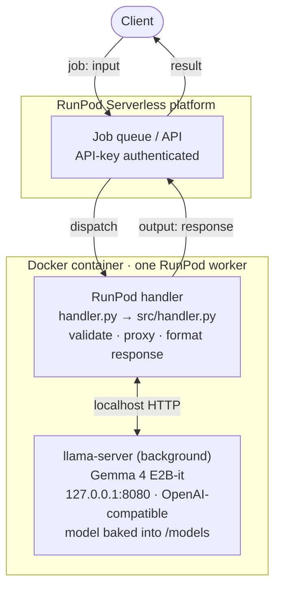

<div align="center">

<a href="https://keduka.com"></a>

# Gemma 4 E2B-it · RunPod Serverless

**OpenAI-compatible Gemma inference on RunPod serverless — powered by llama.cpp.**

[](LICENSE) [](tests) [](https://huggingface.co/unsloth/gemma-4-E2B-it-GGUF) [](https://github.com/ggml-org/llama.cpp) [](https://www.runpod.io/console/serverless)

A project by **[Keduka Cognitive Services (KCS)](https://keduka.com)**

</div>

---

A **RunPod serverless** inference worker for **Gemma 4 E2B-it**, served by
[`llama.cpp`](https://github.com/ggml-org/llama.cpp) with CUDA. One Docker
container runs `llama-server` in the background and a RunPod handler that proxies
job requests to it.

The job I/O contract is a **drop-in replacement** for the reference RunPod LLM
service (`llm-api-deploy`): the same `input` fields and the same response shapes,
so existing clients of that endpoint work against this one unchanged. See
[Backward compatibility](#backward-compatibility).

> **Branch note** — this is the `gemma-4-E2B-runpod` branch. The `main` /
> `gemma-4-E2B` branches host the docker-compose + nginx + Django version of the
> same service.

## Architecture



**Lifecycle.** Base image `ghcr.io/ggml-org/llama.cpp:server-cuda`, with the
model baked in at build time. `entrypoint.sh` starts both processes, supervises
their PIDs, and exits non-zero if either dies so RunPod recycles the worker. On
cold start, `handler.py` blocks on a health gate (`GET /health`) until
`llama-server` is ready, then serves jobs.

## Job input / output

Submit jobs to the RunPod endpoint API with your endpoint id + API key:

```bash
curl -s https://api.runpod.ai/v2/<ENDPOINT_ID>/runsync \
  -H "Authorization: Bearer $RUNPOD_API_KEY" \
  -H "Content-Type: application/json" \
  -d '{"input": {"prompt": "Explain MoE in one sentence."}}'
```

Two input styles are accepted under `input`:

**1. Text prompt** → `{"response": "<text>"}`
```json
{"input": {"prompt": "Hello", "system_prompt": "You are concise."}}
```

**2. Chat (OpenAI-compatible)** → an OpenAI chat-completion object
```json
{"input": {"messages": [{"role": "user", "content": "Hello"}], "model": "gemma-4-e2b-it"}}
```

### Parameters

| Field | Type | Default | Notes |
| --- | --- | --- | --- |
| `messages` / `prompt` | list / str | — | one is required |
| `system_prompt` | str | built-in default | text-prompt style only |
| `max_tokens` | int | `4096` | `1 … MAX_GENERATION_TOKENS` |
| `temperature` | float | `0.00005` | `>= 0` |
| `top_p` | float | `1.0` | `(0.0, 1.0]` |
| `repeat_penalty` | float | `1.2` | `> 0` |
| `think` | bool | `false` | see [Think mode](#think-mode) |
| `stream` | bool | `false` | streaming response |
| `model` / `model_name` | str | `gemma-4-e2b-it` | label echoed back |
| `stop` | str / list | — | up to `MAX_STOP_SEQUENCES` |
| `top_k`, `min_p`, `presence_penalty`, `frequency_penalty`, `seed` | — | — | forwarded only when present |

Unknown fields are ignored (forward-compatible). Invalid input is rejected with:

```json
{"error": {"message": "...", "type": "invalid_request_error"}}
```

`type` is `invalid_request_error` (bad input) or `server_error` (upstream /
internal). Streaming yields `{"response": "<delta>"}` for text-prompt jobs, or
OpenAI chunks for chat jobs.

### Think mode

Gemma 4 E2B-it does not use Qwen-style `/think` directives. When `think=true` the
handler injects a natural-language instruction asking the model to reason inside
`<think>...</think>` tags. When `think=false` (default), any `<think>` block is
stripped from the output, so callers always get a clean answer.

## Examples by language

All examples call the **synchronous** endpoint (`/runsync`) with the text-prompt
input style and read the answer from `output.response`. Export your credentials
first:

```bash
export ENDPOINT_ID=xxxxxxxxxxxx
export RUNPOD_API_KEY=xxxxxxxxxxxx
```

RunPod wraps the handler's return value in a job envelope:
`{"id": ..., "status": "COMPLETED", "delayTime": ..., "executionTime": ..., "output": {...}}`.

- **Async** instead of `/runsync`: POST to `/run` (returns `{"id": ...}`), then
  poll `GET https://api.runpod.ai/v2/$ENDPOINT_ID/status/<id>` until `status` is
  `COMPLETED`.
- **Chat style**: send `{"input": {"messages": [...]}}`; the answer is then at
  `output.choices[0].message.content` (a full OpenAI chat-completion object).

### cURL

```bash
curl -s https://api.runpod.ai/v2/$ENDPOINT_ID/runsync \
  -H "Authorization: Bearer $RUNPOD_API_KEY" \
  -H "Content-Type: application/json" \
  -d '{"input": {"prompt": "Explain MoE in one sentence."}}'
# → {"id":"...","status":"COMPLETED","output":{"response":"Mixture-of-Experts ..."}}
```

### Python

```python
import os, requests

resp = requests.post(
    f"https://api.runpod.ai/v2/{os.environ['ENDPOINT_ID']}/runsync",
    headers={"Authorization": f"Bearer {os.environ['RUNPOD_API_KEY']}"},
    json={"input": {"prompt": "Explain MoE in one sentence."}},
    timeout=600,
)
resp.raise_for_status()
print(resp.json()["output"]["response"])
```

Or with the official [`runpod`](https://pypi.org/project/runpod/) SDK:

```python
import os, runpod

runpod.api_key = os.environ["RUNPOD_API_KEY"]
endpoint = runpod.Endpoint(os.environ["ENDPOINT_ID"])
out = endpoint.run_sync({"prompt": "Explain MoE in one sentence."}, timeout=600)
print(out["response"])
```

### JavaScript / Node.js

```javascript
// Node 18+ (global fetch); ESM (.mjs) for top-level await.
const url = `https://api.runpod.ai/v2/${process.env.ENDPOINT_ID}/runsync`;
const res = await fetch(url, {
  method: "POST",
  headers: {
    Authorization: `Bearer ${process.env.RUNPOD_API_KEY}`,
    "Content-Type": "application/json",
  },
  body: JSON.stringify({ input: { prompt: "Explain MoE in one sentence." } }),
});
const data = await res.json();
console.log(data.output.response);
```

### Go

```go
package main

import (
	"bytes"
	"encoding/json"
	"fmt"
	"io"
	"net/http"
	"os"
)

func main() {
	body, _ := json.Marshal(map[string]any{
		"input": map[string]any{"prompt": "Explain MoE in one sentence."},
	})
	url := "https://api.runpod.ai/v2/" + os.Getenv("ENDPOINT_ID") + "/runsync"
	req, _ := http.NewRequest("POST", url, bytes.NewReader(body))
	req.Header.Set("Authorization", "Bearer "+os.Getenv("RUNPOD_API_KEY"))
	req.Header.Set("Content-Type", "application/json")

	resp, err := http.DefaultClient.Do(req)
	if err != nil {
		panic(err)
	}
	defer resp.Body.Close()

	var out struct {
		Output struct {
			Response string `json:"response"`
		} `json:"output"`
	}
	data, _ := io.ReadAll(resp.Body)
	json.Unmarshal(data, &out)
	fmt.Println(out.Output.Response)
}
```

### Java

```java
// Java 11+ (java.net.http).
import java.net.URI;
import java.net.http.*;

var client = HttpClient.newHttpClient();
String body = "{\"input\": {\"prompt\": \"Explain MoE in one sentence.\"}}";
var req = HttpRequest.newBuilder(URI.create(
        "https://api.runpod.ai/v2/" + System.getenv("ENDPOINT_ID") + "/runsync"))
    .header("Authorization", "Bearer " + System.getenv("RUNPOD_API_KEY"))
    .header("Content-Type", "application/json")
    .POST(HttpRequest.BodyPublishers.ofString(body))
    .build();
var res = client.send(req, HttpResponse.BodyHandlers.ofString());
System.out.println(res.body()); // {... "output": {"response": "..."}}
```

### C#

```csharp
// .NET 6+ (top-level statements).
using System.Net.Http.Headers;
using System.Text;

var http = new HttpClient();
http.DefaultRequestHeaders.Authorization = new AuthenticationHeaderValue(
    "Bearer", Environment.GetEnvironmentVariable("RUNPOD_API_KEY"));
var url = $"https://api.runpod.ai/v2/{Environment.GetEnvironmentVariable("ENDPOINT_ID")}/runsync";
var body = new StringContent(
    "{\"input\": {\"prompt\": \"Explain MoE in one sentence.\"}}",
    Encoding.UTF8, "application/json");
var res = await http.PostAsync(url, body);
Console.WriteLine(await res.Content.ReadAsStringAsync());
```

### Ruby

```ruby
require "net/http"
require "json"

uri = URI("https://api.runpod.ai/v2/#{ENV['ENDPOINT_ID']}/runsync")
req = Net::HTTP::Post.new(uri)
req["Authorization"] = "Bearer #{ENV['RUNPOD_API_KEY']}"
req["Content-Type"] = "application/json"
req.body = { input: { prompt: "Explain MoE in one sentence." } }.to_json

res = Net::HTTP.start(uri.hostname, uri.port, use_ssl: true) { |h| h.request(req) }
puts JSON.parse(res.body).dig("output", "response")
```

### PHP

```php
<?php
$ch = curl_init("https://api.runpod.ai/v2/{$_ENV['ENDPOINT_ID']}/runsync");
curl_setopt_array($ch, [
    CURLOPT_RETURNTRANSFER => true,
    CURLOPT_POST          => true,
    CURLOPT_HTTPHEADER    => [
        "Authorization: Bearer {$_ENV['RUNPOD_API_KEY']}",
        "Content-Type: application/json",
    ],
    CURLOPT_POSTFIELDS    => json_encode(["input" => ["prompt" => "Explain MoE in one sentence."]]),
]);
$data = json_decode(curl_exec($ch), true);
echo $data["output"]["response"], "\n";
```

> **SDKs** — RunPod also publishes official clients: `runpod` (PyPI) and
> `runpod-sdk` (npm), which wrap `/run`, `/runsync`, `/stream`, and `/status`.

## Deploy to RunPod

This repo deploys via **RunPod's GitHub integration**: RunPod builds the image
from the repo's `Dockerfile` and runs it directly — no local build or registry
push required. The root `handler.py` is the entry point RunPod discovers.

### Option A — GitHub deployment (recommended)

1. [RunPod console](https://www.runpod.io/console/serverless) → **New Endpoint**
   → choose **GitHub** as the source; connect your account and select this repo
   and the `gemma-4-E2B-runpod` branch.
2. RunPod builds from the root `Dockerfile`. Set the **`MODEL` build arg**
   (default `gemma-4-e2b-it`, a catalog alias or a direct HTTPS GGUF URL) and any
   runtime env vars (see [Environment variables](#environment-variables)) in the
   endpoint config.
3. Pick a GPU with enough VRAM for the quant + `N_CTX` (40192) and set scaling
   (min/max workers; enable FlashBoot to cut cold starts).
4. Each push to the selected branch triggers an automatic rebuild + redeploy.

### Option B — Docker Hub image (manual / alternative)

Build and push the image yourself, then point the endpoint at the tag:

```bash
docker login
./build_and_push.sh --tag gemma-e2b-serverless --model gemma-4-e2b-it
# or bake a model from a direct URL:
./build_and_push.sh --model-url https://huggingface.co/unsloth/gemma-4-E2B-it-GGUF/resolve/main/gemma-4-E2B-it-UD-Q6_K_XL.gguf
```

Create the endpoint with **Container Image** set to the pushed tag.

In both cases the model is **baked into the image at build time**, so cold start
is load-only (no download). Submit jobs to the endpoint's `/run`, `/runsync`, or
`/stream` API.

## Models

`download-models.sh` resolves a catalog alias or a direct HTTPS URL and writes
the active filename to `$MODELS_DIR/.active_model`:

| Alias | File |
| --- | --- |
| **`gemma-4-e2b-it`** (default) | `gemma-4-E2B-it-UD-Q6_K_XL.gguf` |
| `gemma-4-e2b-it-q4` | `gemma-4-E2B-it-UD-Q4_K_XL.gguf` |

`model-defaults.sh` is the single source of truth for the default. Add models by
extending the `resolve_model` case in `download-models.sh` (and `MODEL_CONFIG` in
`config/__init__.py` if the context size differs).

Optional **speculative decoding (MTP)**: place a draft GGUF in `/models` and set
`DRAFT_MODEL_FILE` — `entrypoint.sh` adds `--model-draft` / `-ngld` automatically.

## Environment variables

Set these on the RunPod endpoint, or in a local `.env` for `docker run`. The
same defaults are baked into the `Dockerfile` `ENV` block; [`.env.example`](.env.example)
is a copy-paste template.

> `MODEL` is a Docker **build arg** (not a runtime variable) — it selects which
> GGUF is baked into the image (a catalog alias like `gemma-4-e2b-it`, or a
> direct HTTPS GGUF URL). See [Deploy to RunPod](#deploy-to-runpod).

### Model selection

| Variable | Default | Description |
| --- | --- | --- |
| `DEFAULT_MODEL_NAME` | `gemma-4-e2b-it` | Response `model` label and the default for `model` / `model_name`. |
| `MODEL_FILE` | _(unset)_ | GGUF filename to serve; overrides the `.active_model` marker and the catalog default. |
| `MODEL_ALIAS` | `gemma-4-e2b-it` | `--alias` reported by llama-server's `/v1/models`. |
| `MODELS_DIR` | `/models` | Directory holding the baked GGUF(s). |

### llama-server flags (consumed by `entrypoint.sh`)

| Variable | Default | Description |
| --- | --- | --- |
| `N_CTX` | `40192` | Context window (`--ctx-size`). |
| `N_GPU_LAYERS` | `-1` | Layers offloaded to GPU (`--n-gpu-layers`; `-1` = all). |
| `N_BATCH` | `512` | `--batch-size`. |
| `N_UBATCH` | `1024` | `--ubatch-size`. |
| `FLASH_ATTN_MODE` | `on` | `--flash-attn` (`on` / `off` / `auto`). |
| `LLAMA_PORT` | `8080` | In-container llama-server port (never published). |
| `DRAFT_MODEL_FILE` | _(unset)_ | Draft GGUF; enables speculative decoding (`--model-draft`) when present in `MODELS_DIR`. |
| `N_GPU_LAYERS_DRAFT` | `99` | Draft-model GPU layers (`-ngld`). |
| `REASONING_FORMAT` | _(unset → off)_ | `--reasoning-format` (e.g. `deepseek`); off for Gemma by default. |

### Handler — cold-start health gate

| Variable | Default | Description |
| --- | --- | --- |
| `LLAMA_SERVER_URL` | `http://127.0.0.1:8080` | Where the handler reaches llama-server. |
| `LLAMA_HEALTH_TIMEOUT` | `300` | Max seconds to wait for `/health` on cold start. |
| `LLAMA_HEALTH_INTERVAL` | `2` | Health-poll interval (seconds). |
| `SKIP_HEALTH_CHECK` | `0` | `1` skips the gate (used by the test suite only). |

### Handler — generation defaults & validation limits

| Variable | Default | Description |
| --- | --- | --- |
| `DEFAULT_SYSTEM_PROMPT` | _(built-in helpful-assistant prompt)_ | System prompt for text-prompt jobs that omit `system_prompt`. |
| `DEFAULT_MAX_TOKENS` | `4096` | Default `max_tokens` when the request omits it. |
| `MAX_GENERATION_TOKENS` | `40192` | Hard cap on `max_tokens` (rejected above this). |
| `MAX_MESSAGES` | `256` | Max chat messages per request. |
| `MAX_CONTENT_LENGTH` | `500000` | Max total content characters (prompt or messages). |
| `MAX_STOP_SEQUENCES` | `16` | Max `stop` entries. |

## Local development & tests

```bash
uv pip install --python .venv/bin/python -r requirements-dev.txt   # if network allows
.venv/bin/pytest                                                    # or:
.venv/bin/python -m unittest discover -s tests -t .
```

Tests mock the `runpod` module and the llama-server HTTP calls, so they run with
no GPU, no network, and no model. A full image build/run requires a Docker + GPU
host with access to `ghcr.io` and the model host.

## Backward compatibility

This endpoint accepts the same `input` fields and returns the same
response/error/streaming shapes as the reference RunPod LLM service, so clients
can switch endpoints without code changes. Model-specific behavior (`think`
handling) differs, but the wire contract does not. Contract regressions are
caught by `tests/test_handler.py` and are treated as breaking changes (version
bump + CHANGELOG).

## Project layout

```
handler.py            # RunPod entry point
src/handler.py        # handler: validation, proxy, streaming, think handling
config/__init__.py    # per-model context sizes, GPU + generation defaults
entrypoint.sh         # starts llama-server + handler, supervises PIDs
download-models.sh    # GGUF catalog (alias or HTTPS URL)
model-defaults.sh     # default model (single source of truth)
Dockerfile            # llama.cpp CUDA base + handler overlay + baked model
build_and_push.sh     # build + push to Docker Hub
requirements.txt      # runtime deps (runpod, huggingface_hub)
requirements-dev.txt  # test deps (pytest)
tests/                # handler + entrypoint test suites
```

## License & ownership

© 2026 **Keduka Cognitive Services (KCS)**. Released under the
[MIT License](LICENSE).

---

<div align="center">

Built and maintained by **[Keduka Cognitive Services (KCS)](https://keduka.com)**

[Website](https://keduka.com) · [GitHub](https://github.com/keduka-ai) · [LinkedIn](https://www.linkedin.com/company/keduka-cognitive-services) · [info@keduka.com](mailto:info@keduka.com)

</div>
